## Domino Hands-On Workshop: Predicting Wine Quality

#### In this workshop you will work through an end-to-end workflow broken into various labs to -

* Read in data from a live source
* Prepare your data in an IDE of your choice, with an option to leverage distributed computing clusters
* Train several models in various frameworks
* Compare model performance across different frameworks and select best performing model
* Deploy model to a containerized endpoint and web-app frontend for consumption
* Leverage collaboration and documentation capabilities throughout to make all work reproducible and sharable!


## Section 1 - Project Set Up

### Lab 1.1 - Forking Existing Projects
Once you have access to the Domino training environment - Guide your mouse to the left blue menu and click the **Search** page. Afterwards, type the word 'Training' in the cell provided and click enter to discover any projects tagged under 'Training'. (The left blue menu shrinks to show only the icon of the pages. Unshrink the left blue menu by guiding your mouse over the icon pages.)

<!-- 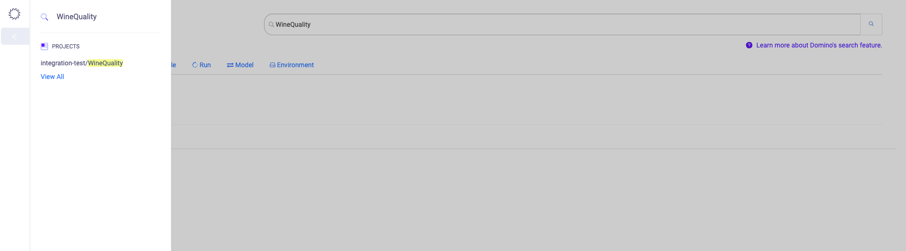 -->

<p align="center">

</p>

Select the project called WineQuality

<!-- 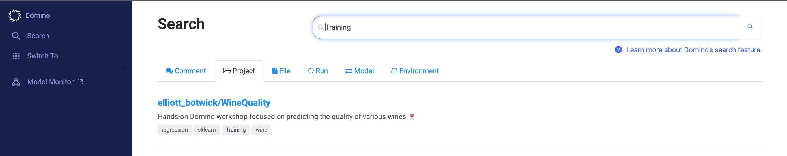 -->

<p align="center">

</p>

Read the readme to learn more about the project's use case, status, etc.

In the top right corner, choose the icon to **fork** the project. Name the project *Domino-Training-yourname*

<!-- 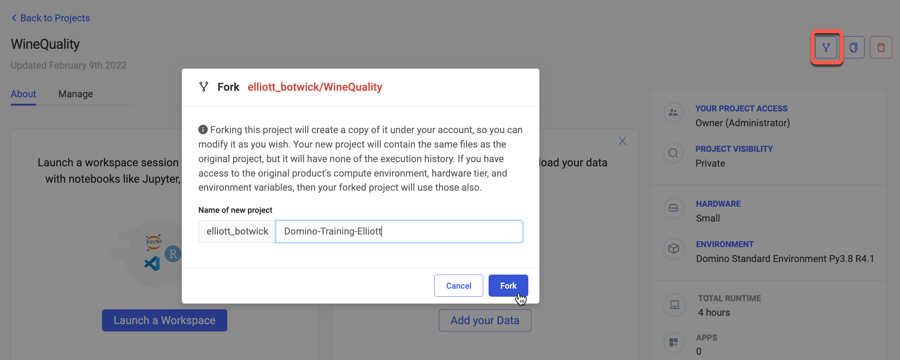 -->

<p align="center">

</p>

In your new project - go into the settings tab

View the default hardware tier and compute environment - ensure they are set to 'Small' and 'Domino-Workshop-Environment' respectively:

<!-- 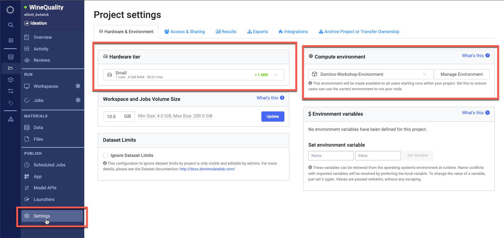 -->

<p align="center">


</p>

Go to the Access and Sharing tab - change your project visibility to **Public**

<!--  -->

<p align="center">

</p>

Add your instructor or another attendee as a collaborator in your project. 
<!-- 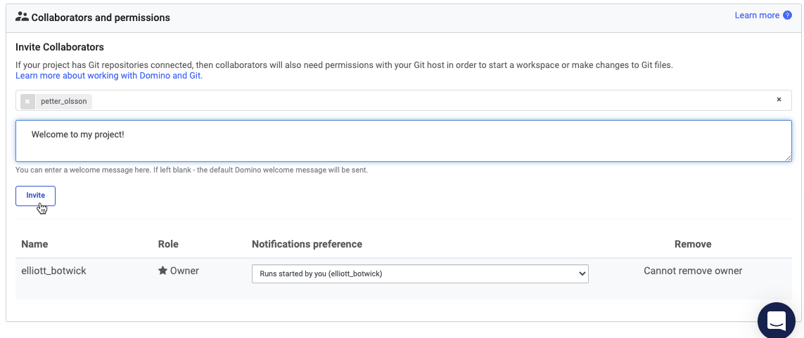 -->

<p align="center">

</p>

Change their permissions to Results Consumer.
<!-- 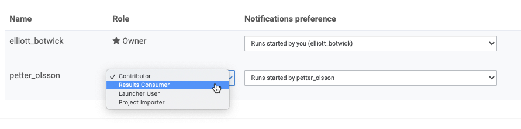 -->

<p align="center">

</p>

### Lab 1.2 - Defining Project Goals

Click back into the Overview area of your project. Then navigate to the Manage tab.

<!-- 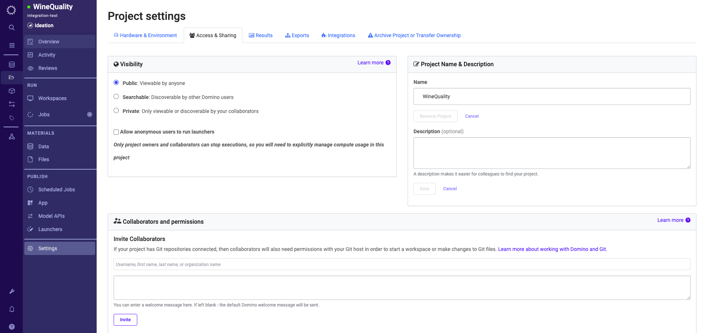 -->

<p align="center">

</p>

Click on Add Goals

<!-- 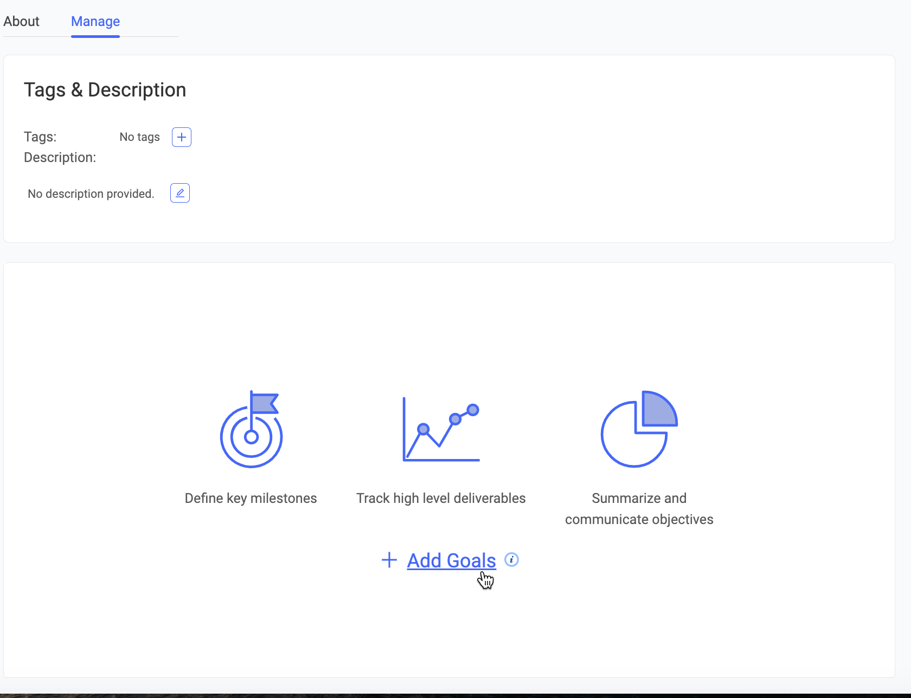 -->

<p align="center">

</p>

For the goal title type in 'Explore Data' and click save. Once the goal is saved click the drop down on the right to mark the goal status as 'Data Acquisition and Exploration'.


<!-- 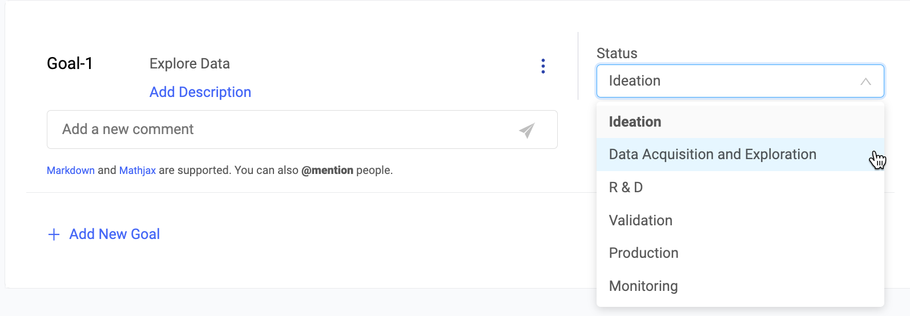 -->

<p align="center">


</p>

[optional] - Add a comment to the goal and tag a collaborator you've added earlier by typing @ then their username. Please click on the paper airplane to submit the comment.

<!-- 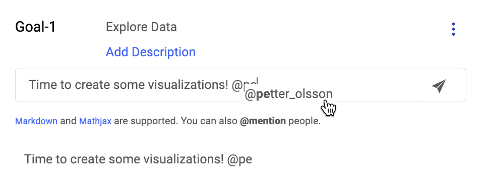 -->

<p align="center">


</p>

### Lab 1.3 - Add Data Source

We will now add a data connection defined by the admin of our project to later query in data. To do so - navigate to the Data tab of your projects. If you're taken to the Domino Datasets view, please click on the Data Sources view instead and click on 'Add a Data Source'

Select the 'domino-winequality-workshop' s3 bucket connection and click add to project

<!-- 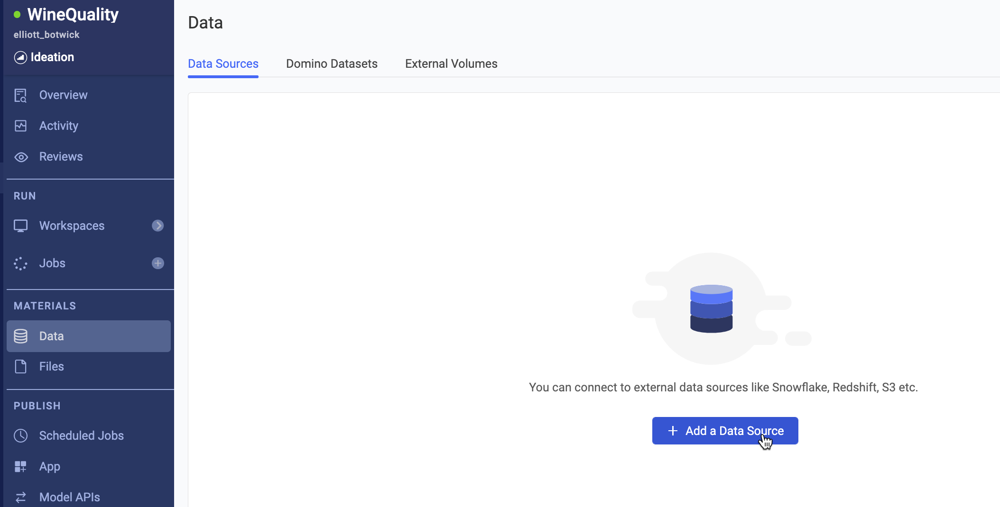 -->

<p align="center">


</p>

Select the 'domino-winequality-workshop' s3 bucket connection and click add to project

<!-- 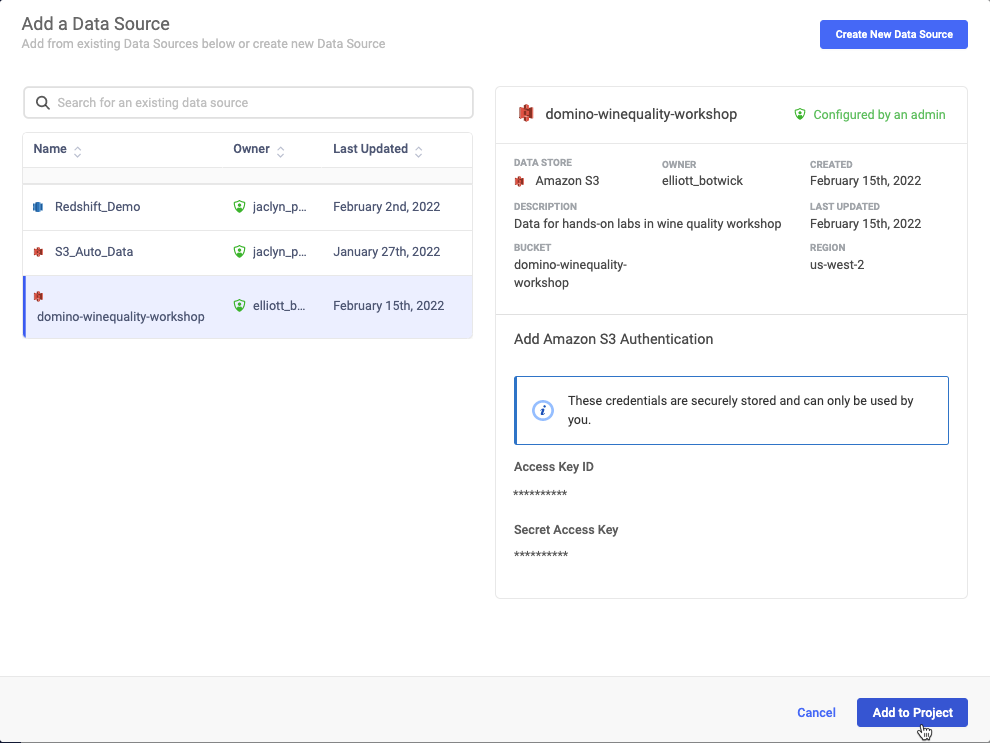 -->

<p align="center">

</p>

The data source should look like the image below

<!--  -->

<p align="center">

</p>

This concludes all labs in section 1 - Prepare Project and Data! 

## Section 2 - Develop Model

### Lab 2.1 - Inspect Compute Environment
From the left blue menu click on the cube icon page called 'Environments'.

<!-- 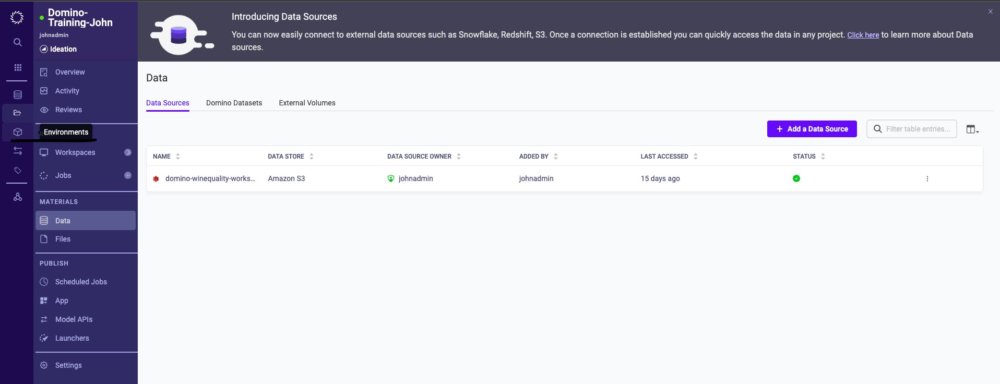 -->

<p align="center">

</p>

Select 'Domino-Workshop-Environment' 

<!-- 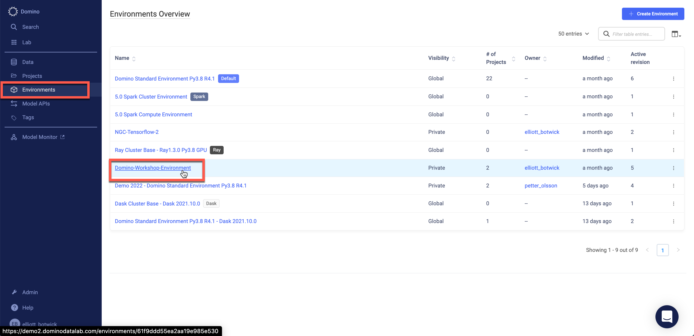 -->

<p align="center">

</p>

Inspect the dockerfile to understand the packages installed, configurations specified, and kernels installed etc. 

Scroll down to Pluggable Workspaces Tools - this is the area in the compute environment where IDEs are made available for end users

Scroll down to the Run Setup Scripts section

Here we have a script that executes upon startup of workspace sessions or job (pre-run script) and a script that executes upon termination of a workspace session or job (post-run script) 

Finally navigate to the Projects tab - you should see all projects that are leveraging this compute environment. Click on your project to navigate back to your project. 

<!-- 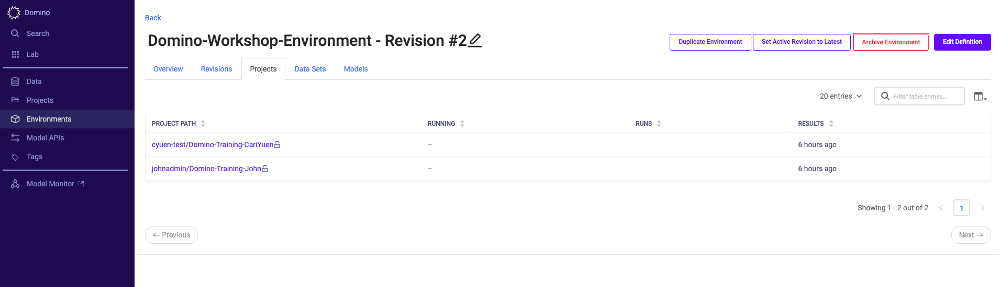 -->

<p align="center">

</p>

Click into the Workspaces tab to prepare for the next lab.

### Lab 2.2 - Exploring Workspaces

In the top right corner click Create New Workspace

<p align="center">

</p>

Type a name for the Workspace in the 'Workspace Name' cell and next click through the available Compute Environments in the Workspace Environment drop down button. Next, ensure that Domino-Workspace-Environment is selected.

Select JupyterLab as the Workspace IDE

Click the Hardware Tier dropdown to browse all available hardware configurations - ensure that Small is selected. 

Click Launch now.

<p align="center">

</p>

Once the workspace is launched, create a new python notebook by clicking here:

<p align="center">

</p>

Once your notebook is loaded, click on the left blue menu and click on the Data page, then onto the data source we added in lab 1 as displayed below

<p align="center">

</p>

Copy the provided code snippet into your notebook and run the cell

<p align="center">

</p>

After running the code snippet. Copy the code below into the following cell 

```python
from io import StringIO
import pandas as pd

s=str(object_store.get("WineQualityData.csv"),'utf-8')
data = StringIO(s) 

df=pd.read_csv(data)
df.head()
```

Now cell by cell, copy the code snippets below and run the cells to visualize and prepare the data! (You can click on the '+' icon to add a blank cell after the current cell)

```python
import seaborn as sns
import matplotlib.pyplot as plt
df['is_red'] = df.type.apply(lambda x : int(x=='red'))
fig = plt.figure(figsize=(10,10))
sns.heatmap(df.corr(), annot = True, fmt='.1g')
```

```python
corr_values = df.corr().sort_values(by = 'quality')['quality'].drop('quality',axis=0)
important_feats=corr_values[abs(corr_values)>0.08]
print(important_feats)
sns.set_theme(style="darkgrid")
plt.figure(figsize=(16,5))
plt.title('Feature Importance for Wine Quality')
plt.ylabel('Pearson Correlation')
sns.barplot(important_feats.keys(), important_feats.values, palette='seismic_r')
```
```python
for i in list(important_feats.keys())+['quality']:
    plt.figure(figsize=(8,5))
    plt.title('Histogram of {}'.format(i))
    sns.histplot(df[i], kde=True)
```

Finally write your data to a Domino Dataset by running

```python
import os
path = str('/domino/datasets/local/{}/WineQualityData.csv'.format(os.environ.get('DOMINO_PROJECT_NAME')))
df.to_csv(path, index = False)
```

Your notebook should be populated like the display below.

<!-- 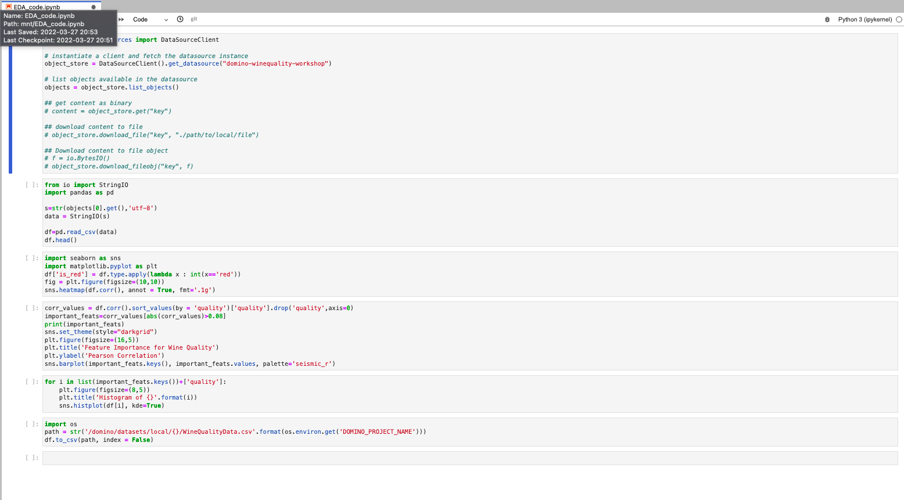 -->

<p align="center">

</p>

Rename your notebook 'EDA_code.ipynb' by right clicking on the file name as shown below then click the Save icon.

<p align="center">

</p>

### Lab 2.3 - Syncing Files

Now that we've finished working on our notebook and written data back to our project, we want to sync our latest work. To do so click on the File Changes tab in the top left corner of your screen - 

<p align="center">

</p>

Enter an informative but brief commit message such as "Completed EDA notebook" and click to Sync All Changes. 

Click the Domino logo on the upper left corner of the blue menu and select on the Project page. Then select your project followed by selecting “Files” on the left blue menu as shown below.   

Notice that the latest commit will reflect the commit message you just logged and you can see 'EDA_code.ipynb' in your file directory.

<p align="center">

</p>

Click on your notebook to view it. On the top of your screen and click 'Link to Goal' in the dropdown, after selecting the goal you created in Lab 1.2

<p align="center">

</p>

Now navigate to Overview, then to the manage tab and see your linked notebook.

Click the ellipses on the goal to mark the goal as complete

<p align="center">

</p>


### Lab 2.4 - Run and Track Experiments

Now it's time to train our models! 

We are taking a three pronged approach and building a model in sklearn (python), xgboost (R), and an auto-ml ensemble model (h2o).

First, navigate back to your JupyterLab workspace tab. In your file browser go into the scripts folder and inspect 'multitrain.py'

<p align="center">

</p>

Check out the code in the script and comments describing the purpose of each line of code.

You can also check out any of the training scripts that multitrain.py will call.

Now switch into your other browser tab to return to your domino project. Navigate to the Jobs page. Click on **Run**.

<p align="center">

</p>

Type in the following command below in the **File Name** section of the **Start a Job** pop up window. Click on **Start** to run the job.

```shell
scripts/multitrain.py
```

<p align="center">

</p>

Watch as three job runs have appeared, you may see them in starting, running or completed state.

<p align="center">

</p>

Click into the sklearn_model_train.py job run.

In the details tab of the job run note that the compute environment and hardware tier are tracked to document not only who ran the experiment and when, but what versions of the code, software, and hardware were executed.

<p align="center">

</p>


Click on the Results tab of the job. Scroll down to view the visualizations and other outputs of the job.

<p align="center">

</p>


We've now trained 3 models and it is time to select which model we'd like to deploy.

**Refresh the page**. Inspect the table and graph to understand the R^2 value and Mean Squared Error (MSE) for each model. From our results it looks like the sklearn model is the best candidate to deploy.

In the next section of labs we will deploy the model we trained here!


## Section 3 - Deploy Model

### Lab 3.1 Deploying Model API Endpoint

Now that you have completed model training and selection - it's time to get your model deployed.

In the last lab - we trained a sklearn model and saved it to a serialized (pickle) file. To deploy this trained model - we'll use a script to load in the saved model object and pass new records for scoring. 

To do so - navigate to the **Model APIs** tab in your project. Click **New Model**.

<p align="center">

</p>

Name your model 'wine-model-yourname'
    
For the description add the following 
    
```
Model Endpoint to determine the quality of wine

Sample Scoring Request: 
    
{
  "data": {
    "density":0.99,
    "volatile_acidity": 0.028,
    "chlorides": 0.05 ,
    "is_red":0,
    "alcohol": 11
  }
}
```
    
Be sure to check the box *Log HTTP requests and responses to model instance logs* 

<p align="center">

</p>    

Click **Next**. On the next page - 
    
For **Choose an Environment** select
`Domino-Workshop-Environment`

For **The file containing the code to invoke (must be a Python or R file)** enter

`scripts/predict.py`
    
For **The function to invoke** enter
    
`predict`
    
And click **Create Model**
    
<p align="center">

</p>        
  
Over the next 2-5 minutes, you'll see the status of your model go from Preparing to Build -> Building -> Starting -> Running
<p align="center">

</p>        
    
    
Once your model reaches the Running state - a pod containing your model object and code for inference is up and ready to accept REST API calls.

To test your model navigate to the Overview tab. In the request field in the Tester tab enter a scoring request in JSON form. You can copy the sample request that you defined in your description field.
    
<p align="center">

</p>        
    
In the response box you will see a **prediction** value representing your model's predicted quality for a bottle of wine with the attributes defined in the Request box. Try changing 'is_red' from 0 to 1 and 'alcohol' from 11 to 5 to see how the predicted quality differs. Feel free to play around with different values in the Request box.

After you have sent a few scoring requests to the model endpoint, check out the instance logs by clicking the Instance Logs button. Here you can see that all scoring requests to the model complete with model inputs, responses, response times, errors, warnings etc. are being logged. Close the browser tab that you were viewing the instance logs in. 

Now, back on your model's overview page - note that there are several tabs next to the **Tester** tab that provide code snippets to score our model from a web app, command line, or other external source.

In the next lab we will deploy an R shiny app that exposes a front end for collecting model input, passing that input to the model, then parsing the model's response to a dashboard for consumption.

### Lab 3.2 Deploying Web App
    
Now that we have a pod running to serve new model requests - we will build out a front end to make calling our model easier for end-users.
    
To do so - in a new browser tab first navigate back to your Project and then in the left blue menu of your project click into the **Files** section and click **New File**
<p align="center">

</p>     

Next, we will create a file called app.sh. It's a bash script that will start and run the Shiny App server based on the inputs provided.
Copy the following code snippet in - 

```shell
#!/usr/bin/env bash
 
# This is a bash script for Domino's App publishing feature
# Learn more at http://support.dominodatalab.com/hc/en-us/articles/209150326
 
## R/Shiny Example
## This is an example of the code you would need in this bash script for a R/Shiny app
R -e 'shiny::runApp("./scripts/shiny_app.R", port=8888, host="0.0.0.0")'
 
## Flask example
## This is an example of the code you would need in this bash script for a Python/Flask app
#export LC_ALL=C.UTF-8
#export LANG=C.UTF-8
#export FLASK_APP=app-flask.py
#export FLASK_DEBUG=1
#python -m flask run --host=0.0.0.0 --port=8888
 
## Dash Example
## This is an example of the code you would need in this bash script for a Dash app
#python app-dash.py
```
Name the file **app.sh** and click **Save**
<p align="center">

</p>         


Now navigate back into the Files tab, and enter the **scripts** folder. Click add a new file and name it `shiny_app.R` (make sure the file name is exactly that, it is case sensitive) and then paste the following into the file -

```R
#
# This is a Shiny web application. You can run the application by clicking
# the 'Run App' button above.
#
# Find out more about building applications with Shiny here:
#
#    http://shiny.rstudio.com/
#
 
install.packages("png")
 
library(shiny)
library(png)
library(httr)
library(jsonlite)
library(plotly)
library(ggplot2)
 
 
# Define UI for application that draws a histogram
ui <- fluidPage(
  
  # Application title
  titlePanel("Wine Quality Prediction"),
  
  # Sidebar with a slider input for number of bins 
  sidebarLayout(
    sidebarPanel(
      numericInput(inputId="feat1",
                   label='density', 
                   value=0.99),
      numericInput(inputId="feat2",
                   label='volatile_acidity', 
                   value=0.25),
      numericInput(inputId="feat3",
                   label='chlorides', 
                   value=0.05),
      numericInput(inputId="feat4",
                   label='is_red', 
                   value=1),
      numericInput(inputId="feat5",
                   label='alcohol', 
                   value=10),
      actionButton("predict", "Predict")
    ),
    
    # Show a plot of the generated distribution
    mainPanel(
      tabsetPanel(id = "inTabset", type = "tabs",
                  
                  tabPanel(title="Prediction",value = "pnlPredict",
                           plotlyOutput("plot"),
                           verbatimTextOutput("summary"),
                           verbatimTextOutput("version"),
                           verbatimTextOutput("reponsetime"))
      )        
    )
  )
)
 
prediction <- function(inpFeat1,inpFeat2,inpFeat3,inpFeat4,inpFeat5) {
  
#### COPY FULL LINES 4-7 from R tab in Model APIS page over this line of code. (It's a simple copy and paste) ####
    
    body=toJSON(list(data=list(density = inpFeat1, 
                               volatile_acidity = inpFeat2,
                               chlorides = inpFeat3,
                               is_red = inpFeat4,
                               alcohol = inpFeat5)), auto_unbox = TRUE),
    content_type("application/json")
  )
  
  str(content(response))
  
  result <- content(response)
}
 
gauge <- function(pos,breaks=c(0,2.5,5,7.5, 10)) {
 
  get.poly <- function(a,b,r1=0.5,r2=1.0) {
    th.start <- pi*(1-a/10)
    th.end   <- pi*(1-b/10)
    th       <- seq(th.start,th.end,length=10)
    x        <- c(r1*cos(th),rev(r2*cos(th)))
    y        <- c(r1*sin(th),rev(r2*sin(th)))
    return(data.frame(x,y))
  }
  ggplot()+
    geom_polygon(data=get.poly(breaks[1],breaks[2]),aes(x,y),fill="red")+
    geom_polygon(data=get.poly(breaks[2],breaks[3]),aes(x,y),fill="gold")+
    geom_polygon(data=get.poly(breaks[3],breaks[4]),aes(x,y),fill="orange")+
    geom_polygon(data=get.poly(breaks[4],breaks[5]),aes(x,y),fill="forestgreen")+
    geom_polygon(data=get.poly(pos-0.2,pos+0.2,0.2),aes(x,y))+
    geom_text(data=as.data.frame(breaks), size=5, fontface="bold", vjust=0,
              aes(x=1.1*cos(pi*(1-breaks/10)),y=1.1*sin(pi*(1-breaks/10)),label=paste0(breaks)))+
    annotate("text",x=0,y=0,label=paste0(pos, " Points"),vjust=0,size=8,fontface="bold")+
    coord_fixed()+
    theme_bw()+
    theme(axis.text=element_blank(),
          axis.title=element_blank(),
          axis.ticks=element_blank(),
          panel.grid=element_blank(),
          panel.border=element_blank())
}
 
# Define server logic required to draw a histogram
server <- function(input, output,session) {
  
  observeEvent(input$predict, {
    updateTabsetPanel(session, "inTabset",
                      selected = paste0("pnlPredict", input$controller)
    )
    print(input)
    result <- prediction(input$feat1, input$feat2, input$feat3, input$feat4, input$feat5)
    print(result)
    
    pred <- result$result[[1]][[1]]
    modelVersion <- result$release$model_version_number
    responseTime <- result$model_time_in_ms
    output$summary <- renderText({paste0("Wine Quality estimate is ", round(pred,2))})
    output$version <- renderText({paste0("Model version used for scoring : ", modelVersion)})
    output$reponsetime <- renderText({paste0("Model response time : ", responseTime, " ms")})
    output$plot <- renderPlotly({
      gauge(round(pred,2))
    })
  })
  
}
 
# Run the application 
shinyApp(ui = ui, server = server)
```

**Go to line 63** note that this is missing input for your model api endpoint. In a new tab navigate to your model API you just deployed. Go into overview and select the R tab as shown below. Copy lines 4-7 from the R code snippet. Switch back to your new file tab and paste the new lines in line 64 in your file.

<p align="center">

</p>                    
Lines 61-79 in your file should look like the following (note the url and authenticate values will be different) 
                   
<p align="center">

</p>         

Click **Save**
                   
Now that you have your app.sh and shiny_app.R files created. Navigate to the **App** tab in your project

Enter a title for your app - 'wine-app-yourname'

<p align="center">

</p>       

Click Publish.
                   
You'll now see the below screen, once your app is active (should be within ~1-3 minutes) you can click the View App button. 

<p align="center">

</p>       
        
Once you're in the app you can try out sending different scoring requests to your model using the form on the right side of your page. Click **predict** to send a scoring request and view the results in the visualization on the left side.
                   
<p align="center">

</p>         

## Section 4 - Collaborate Results

### Lab 4.1 - Share Web App and Model API

Congratulations! You have now gone through a full workflow to pull data from an S3 bucket, clean and visualize the data, train several models across different frameworks, deploy the best performing model, and use a web app front end for easy scoring of your model. Now the final step is to get your model and front end into the hands of the end users.

To do so we will navigate back to our project and click on the **App** tab

<p align="center">

</p>         


From the App page navigate to the **Permissions** tab

In the permissions tab update the permissions to allow anyone, including anonymous users

<p align="center">

</p>         

Navigate back to the **settings** tab and click **Copy Link App**

<p align="center">

</p>       

Paste the copied link into a new private/incognito window. Note that you're able to view the app without being logged into Domino. Try sending this URL to a colleague at your company to show them the work you've done.

PS - Domino provides free licenses for business users to login and view models/apps etc.

### *** End of Labs *** 

So now that we've got our model into production are we done? No! We want to make sure that any models we deploy stay healthy over time, and if our models do drop in performance, we want to quickly identify and remediate any issues. Stay tuned for a demo of integrated model monitoring to see how a ML Engineer would automate the model monitoring process and make remediation a breeze.


